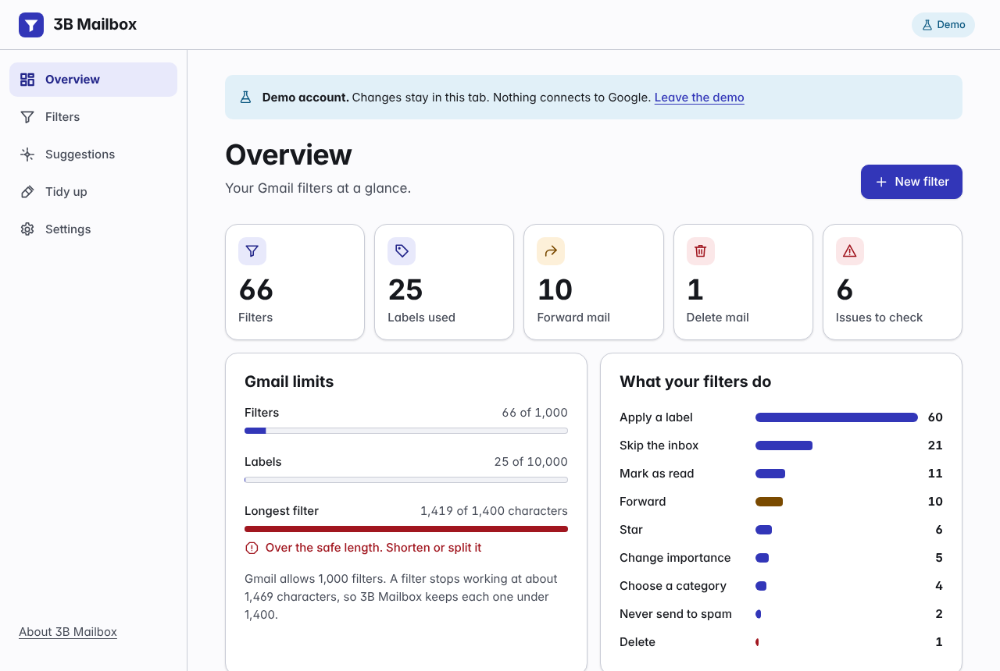
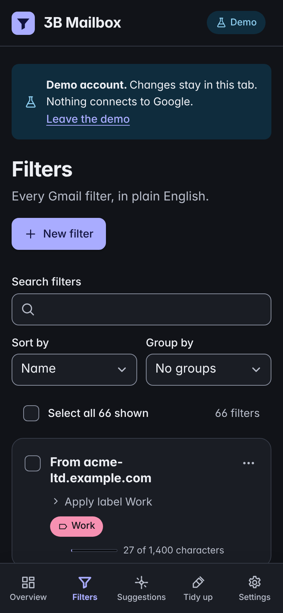
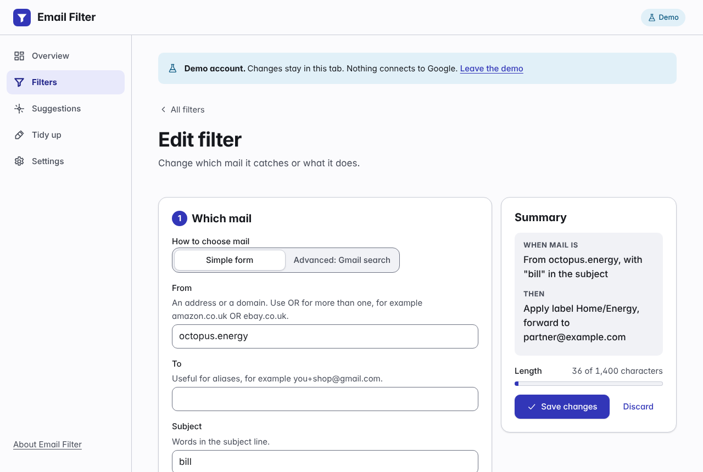
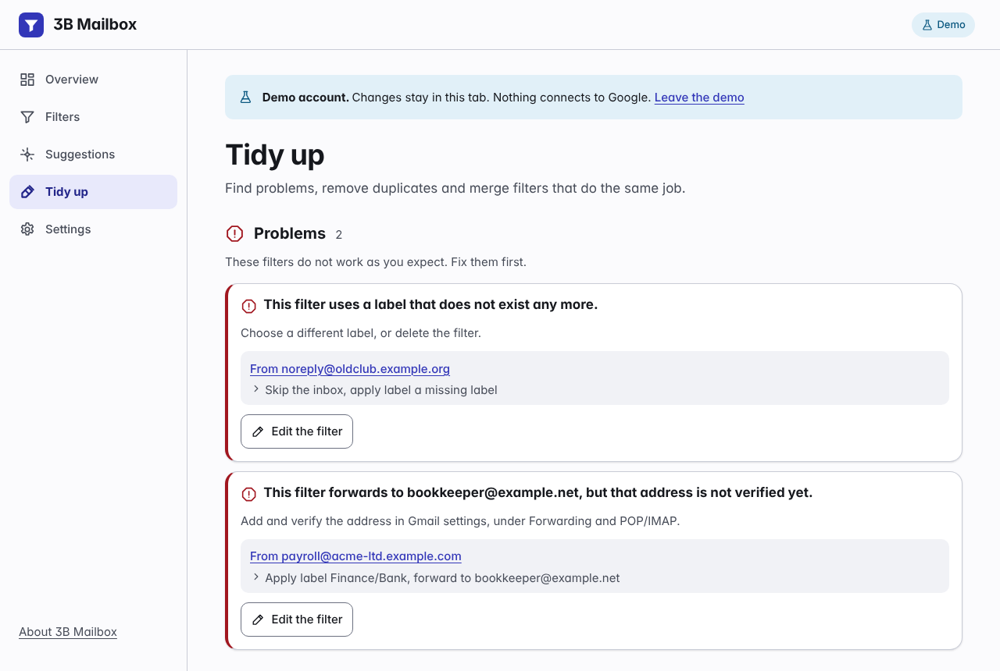

# Email Filter

A free, open-source and private filter manager for Gmail. It runs fully in your browser.

**Status: pre-release, not deployed.**

Email Filter shows all your Gmail filters in one clear view. It finds duplicates and conflicts, merges filters that do the same job, makes bulk changes with a preview first, and helps you make new filters from a form or from ready-made suggestions. It is a static web app (a PWA). It has no server, no analytics, no cookies and no third-party scripts except the Google sign-in script. The maintainer receives no data.

Email Filter is an independent project. Google does not make, endorse or support it.

## Screenshots

These come from the built-in demo account. Open `app/?demo` to try it with no Google sign-in.

| Overview                                                                                                                 | Filters (phone, dark)                                                           |
| ------------------------------------------------------------------------------------------------------------------------ | ------------------------------------------------------------------------------- |
|  |  |

| Edit a filter                                                                                                  | Tidy up                                                                                               |
| -------------------------------------------------------------------------------------------------------------- | ----------------------------------------------------------------------------------------------------- |
|  |  |

More in [docs/screenshots](docs/screenshots).

## Quick start

You can use Email Filter with Google sign-in or without it.

- **With sign-in**, changes go straight to Gmail, and you can see matching mail. You need your own Google Cloud OAuth client ID. It is free and takes about 10 minutes to make. See [Setup](#setup).
- **Without sign-in**, you need no client ID and no Google permission. The app makes no network requests apart from loading its own files. See [No sign-in mode](#no-sign-in-mode).

You can run the app in three ways:

1. **Use the hosted copy.** Add the hosted copy's origin to your client ID, open the app and paste your client ID. The hosted copy is not live yet.
2. **Host your own copy.** Publish the `site/` folder on any static host that serves HTTPS (GitHub Pages, Cloudflare Pages, Netlify, a home server). Every link in the app is relative, so it works at any address: a custom domain or subdomain, a path on a shared host, or `localhost`. For sign-in, give it its own origin, for example `https://filters.example.com`, because sites that share an origin share browser storage.
3. **Run it on your computer.**

   ```sh
   git clone https://github.com/jackbremer/gmail-butler.git
   cd gmail-butler
   npm install
   npm run dev
   ```

   `npm run dev` picks a free port at random and prints the address. Google sign-in needs the same origin each time, so for sign-in use a fixed port: `npm run dev -- --port 8080`, then add `http://127.0.0.1:8080` to your client ID.

To look around first, open the app with `?demo` (for example `http://127.0.0.1:8080/app/?demo`). The demo uses made-up data and does not connect to Google.

## No sign-in mode

Use this if you do not want to make a Google Cloud client ID or see Google's "unverified app" warning.

1. In Gmail, open **Settings**, **See all settings**, **Filters and blocked addresses**. Select all your filters and choose **Export**. Your browser saves `mailFilters.xml`.
2. Open the app and choose **Work without signing in**. Choose the file, or drag it onto the page.
3. Use the app as normal: overview, filter list, editor, suggestions, tidy up, bulk changes and undo.
4. Choose **Download for Gmail** to save the new file.
5. In Gmail, select all your filters and delete them. Then choose **Import filters**, choose the new file and choose **Create filters**. Gmail import adds filters and never deletes them, so delete the old ones first.

What you give up: the app cannot show matching mail or apply a filter to mail you already have. Gmail matches labels by name and makes any that are missing. Forwarding works only to addresses you have already verified in Gmail. Your changes stay in the browser tab until you download them. The app warns you before you close or reload the tab with changes you have not downloaded.

## Setup

The full guide, with steps for personal Gmail and Google Workspace and a list of common mistakes, is on the site: [`site/index.html#setup`](site/index.html#setup).

In short:

1. In the Google Cloud console, create a project.
2. In **APIs & Services**, **Library**, enable the **Gmail API**.
3. In **Google Auth Platform**, select **Get started**. Enter an app name and your email. Set **Audience** to **External** (personal Gmail) or **Internal** (Google Workspace).
4. Personal Gmail only: in **Audience**, keep the status at **Testing** and add your address under **Test users**.
5. In **Clients**, create a **Web application** client. Add the app's origin under **Authorized JavaScript origins**. The origin has no path and no slash at the end.
6. Copy the client ID into the app and sign in. In Testing mode Google shows an "unverified app" warning. It is your own app, so it is safe to continue.

## Privacy

- The app runs in your browser. Data goes only between your browser and Google (`accounts.google.com` and `gmail.googleapis.com`).
- In no sign-in mode the app reads only the file you choose. Nothing leaves the browser, and the app does not contact Google.
- The access token lives in memory only. It lasts about 1 hour. The app uses the Google Identity Services token model, which never issues a refresh token.
- Local storage holds only your client ID, your settings and an undo list of filters that you deleted. You can delete all of it in the app.
- No server, no analytics, no cookies, no error reporting service, no external fonts.

The full privacy policy is on the site: [`site/index.html#privacy`](site/index.html#privacy).

## Permission tiers

The app asks for each tier only when you turn on a feature that needs it.

| Tier    | What it lets the app do                                                     | Google scopes                          |
| ------- | --------------------------------------------------------------------------- | -------------------------------------- |
| Basic   | Read and change filters and labels. Read your list of forwarding addresses. | `gmail.settings.basic`, `gmail.labels` |
| Preview | Show the mail that a filter matches (sender, subject and date).             | Basic, plus `gmail.readonly`           |
| Apply   | Apply a filter to mail that you already have.                               | Preview, plus `gmail.modify`           |

`gmail.settings.basic`, `gmail.readonly` and `gmail.modify` are restricted scopes. This is why each person uses their own client ID.

## Limits

| Limit                      | Value                           | Notes                                                           |
| -------------------------- | ------------------------------- | --------------------------------------------------------------- |
| Filters per account        | 1,000                           | Published by Google.                                            |
| Filter criteria length     | About 1,469 to 1,488 characters | Not published. The app uses a safe cap of 1,400.                |
| Access token lifetime      | About 1 hour                    | The app warns you first and lets you renew without losing work. |
| Test users in Testing mode | 100                             | Per Google Cloud project.                                       |
| Refresh tokens in Testing  | End after 7 days                | Does not affect this app. It never gets a refresh token.        |

All limits live in one file: `site/app/js/core/limits.js`.

## Development

You need Node.js 22 or later. There is no build step. The files in `site/` are published as they are.

| Script              | What it does                                                    |
| ------------------- | --------------------------------------------------------------- |
| `npm run dev`       | Serves `site/` on a free random port. Add `-- --port N` to fix. |
| `npm test`          | Unit tests (Vitest).                                            |
| `npm run test:e2e`  | End-to-end and accessibility tests (Playwright and axe-core).   |
| `npm run lint`      | ESLint.                                                         |
| `npm run typecheck` | Type checks the JSDoc types with TypeScript.                    |
| `npm run check`     | Lint, format check, type check and unit tests.                  |

If you have a Chromium binary already, set `CHROMIUM_PATH` for the end-to-end tests.

## Project structure

```
site/
  index.html        Landing page, setup guide, privacy policy, accessibility statement
  assets/           Landing page styles and icon
  app/              The app (HTML, CSS, JavaScript modules, service worker)
    css/tokens.css  Design tokens shared by the app and the landing page
    js/core/        Pure logic, no DOM and no network
    js/gmail/       Sign-in, Gmail API client, plan executor, mock API
    js/ui/          Views and components
tests/
  unit/             Vitest
  e2e/              Playwright and axe-core
scripts/serve.mjs   Zero-dependency static server
docs/               Architecture and design notes
```

See [docs/ARCHITECTURE.md](docs/ARCHITECTURE.md) for the module contracts and [PLAN.md](PLAN.md) for the plan.

## Contributing

See [CONTRIBUTING.md](CONTRIBUTING.md). To report a security problem, see [SECURITY.md](SECURITY.md).

## Licence

[AGPL-3.0-only](LICENSE). Gmail, Google, Google Cloud and Google Workspace are trademarks of Google LLC.
